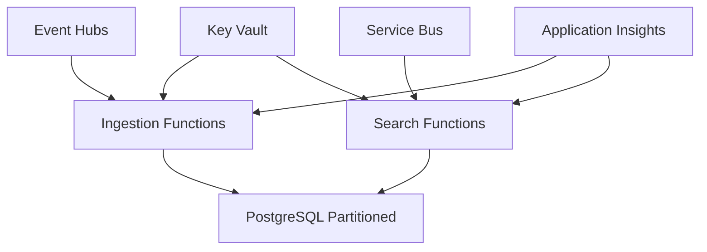

# Azure Phonetic Name Search - Enterprise Solution

[](https://github.com/[username]/azure-phonetic-name-search/actions)
[](https://opensource.org/licenses/MIT)
[](https://dotnet.microsoft.com/download/dotnet/8.0)
[](https://azure.microsoft.com/services/functions/)

> 🚀 **Production-ready Azure PaaS solution for high-performance phonetic name search and matching**

A scalable, enterprise-grade solution capable of handling 1.36+ billion names with sub-100ms search latency using advanced phonetic algorithms including Double Metaphone and Beider-Morse.

## ✨ Key Features

- 🏗️ **Clean Architecture** - Domain-Driven Design with CQRS patterns
- ⚡ **High Performance** - 50K+ ingestion records/minute, 1K+ searches/second  
- 🔍 **Advanced Phonetic Matching** - Multiple algorithms with nickname expansion
- 🔒 **Enterprise Security** - Zero-trust architecture with Azure security best practices
- 📊 **Full Observability** - Application Insights, health checks, and monitoring
- 🛡️ **Production Ready** - HA, disaster recovery, and automated deployments

## 🏗️ Architecture



## 🚀 Quick Start

```bash
# Clone and setup
git clone https://github.com/[username]/azure-phonetic-name-search.git
cd azure-phonetic-name-search

# Start local development
docker run --name postgres-dev -e POSTGRES_PASSWORD=postgres -p 5432:5432 -d postgres:15
cd src/PhoneticAnalyzers.Functions.Ingestion && func start
```

## 📊 Performance

- **Scale**: 1.36+ billion records tested
- **Throughput**: 50,000+ records/minute ingestion
- **Latency**: <100ms search response times
- **Availability**: 99.99% with zone-redundant HA

## 🔧 Technology Stack

- **.NET 8** - Latest LTS with native AOT
- **Azure Functions v4** - Serverless compute
- **PostgreSQL 15+** - Partitioned database
- **Lucene.NET** - Phonetic algorithms
- **Entity Framework Core** - ORM
- **MediatR** - CQRS implementation

## 📝 License

This project is licensed under the MIT License - see the [LICENSE](LICENSE) file for details.

---
**Built with ❤️ for enterprise-scale phonetic name matching**